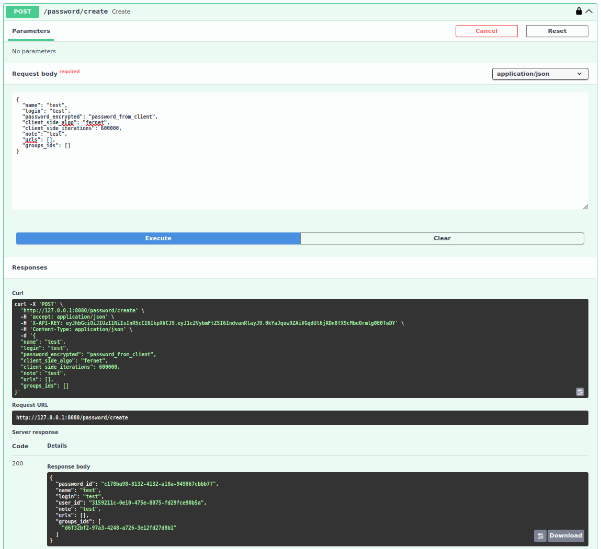

## Password manager
An API for storage your passwords. You can create your account and store your passwords in secure way

Dockerhub: https://hub.docker.com/repository/docker/wojtek9502/password-manager-api  
Kubernetes local deploy with Minikube: https://github.com/wojtek9502/password-manager-k8s

<!-- TOC -->
  * [Password manager](#password-manager)
    * [Requirements](#requirements)
    * [Run from Docker](#run-from-docker)
    * [Install and run from source](#install-and-run-from-source)
    * [Test](#test)
    * [Coverage](#coverage)
  * [Develop](#develop)
    * [pgadmin](#pgadmin)
<!-- TOC -->

### Screenshots
<details>
<summary>Click to see</summary>




</details>

### Requirements
- Python 3.10
- Docker >=  24.0.5
- docker-compose >= 2.23.3

### Run from Docker
1. Create .env file in main dir. See .env.example
2. Create docker-compose file like below:
```yaml
version: '3.6'
services:
  db:
    image: postgres:16.1-bullseye
    container_name: 'password-manager-db'
    environment:
      TZ: Europe/Warsaw
      POSTGRES_DB: password-manager
      POSTGRES_USER: admin
      POSTGRES_PASSWORD: admin
    network_mode: host
    volumes:
      - '/tmp/volumes/password_manager/db:/var/lib/postgresql/data'

  password-manager-api:
    image: 'wojtek9502/password-manager-api'
    container_name: 'password-manager'
    command: bash -c 'alembic upgrade head && python run_server.py --port 8080'
    env_file: .env
    volumes:
      - '/tmp/volumes/password_manager/logs:/app/logs'
    network_mode: host
    depends_on:
      - db
```
3. Run ```make up```
4) Go to http://127.0.0.1:8080/swagger-ui

### Install and run from source
1) Install venv and activate:
```shell
python -m pip install virtualenv
make install-venv
make install
source venv/bin/activate
```
2) Create .env file in main dir. See .env.example
3) Run containers
```shell
make up-build
````
4) Go to http://127.0.0.1:5000/swagger-ui
5) Create your user with /user/create endpoint. Use API_AUTH_MASTER_TOKEN from .env file to authorize
6) Sign in with user from prev step, use /user/login endpoint. Use token from response to authorize instead of API_AUTH_MASTER_TOKEN


### Test
Run 1-3 steps from 'Install and run' and run command
```shell
make test
```

### Coverage
Run 1-3 steps from 'Install and run' and run command
```shell
make coverage
```

## Develop
You can run run_server.py to start http server instead of rebuilding the app container after every change
```shell
make up
make db-upgrade
python run_server.py
```

### pgadmin
1) Run pgadmin
```shell
make run-pgadmin
```
2) Go to http://127.0.0.1/login?next=%2Fbrowser%2F
3) Email\password: admin@admin.com \ admin
4) Connect with db. Host: 127.0.0.1 Port: 5432 Login/password (see docker-compose.yaml)
